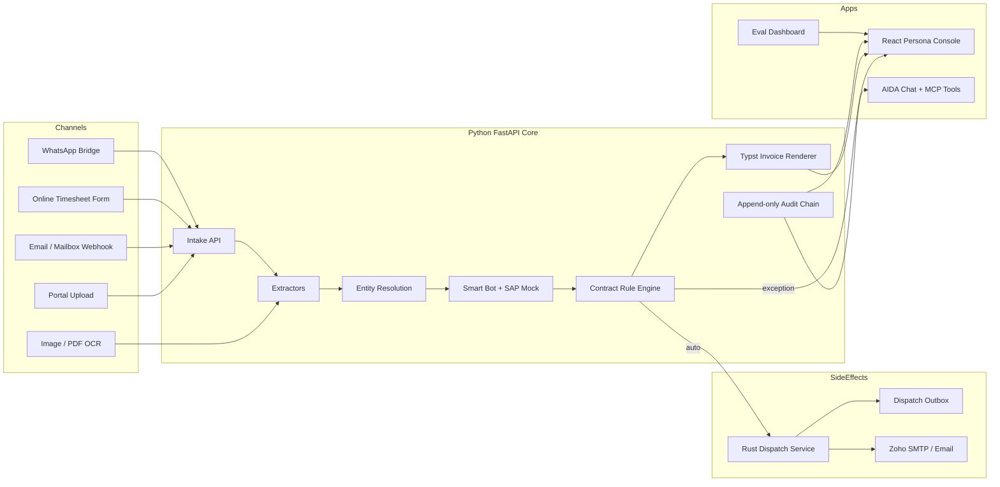
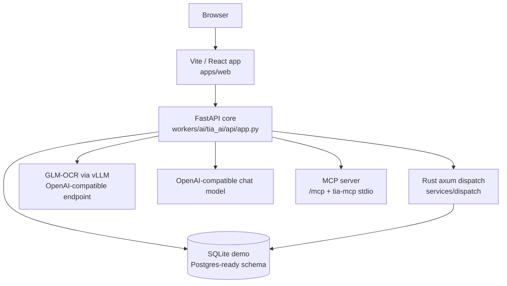
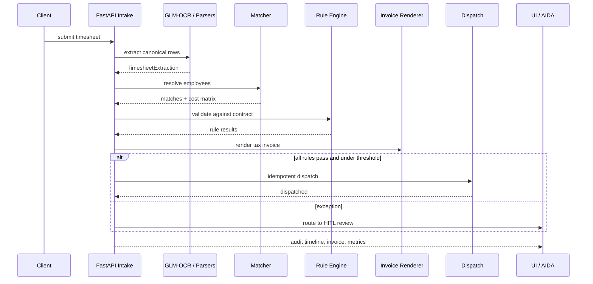

# TIA - Touchless Invoice Agent

[](https://github.com/cyberkunju/tia/actions/workflows/ci.yml)

> **Timesheet in. Contract-validated tax invoice out. Humans only by exception.**

TIA is an end-to-end invoice automation system built for the **TASC Outsourcing
HackArena 2.0 challenge**. It ingests staffing timesheets from messy real-world
channels, extracts attendance data, reconciles employees against master data,
validates the generated invoice against the client contract, dispatches the
invoice, and gives Client, FinOps, and Finance teams a shared operating console.

The core idea is simple: most automation tools read invoices. **TIA reads the
source timesheet and validates the invoice against the contract before it leaves
the building.**

---

## Why This Exists

Staffing invoices are not born as invoices. They start as timesheets:

- clean Excel files from some clients
- punch-clock spreadsheets from others
- email bodies and quoted reply threads
- typed PDFs
- photos of handwritten registers
- ad hoc online submissions
- WhatsApp/media attachments

Finance teams then re-key rows, match names to employees, check contract terms,
generate invoices, sort them per client dispatch rules, and email them out. The
brief target was explicit: **80%+ touchless**, **within minutes**, **99%+
accuracy with low-confidence routing to people**.

TIA implements that as a deterministic workflow with model-assisted document
reading at the edges.

---

## Product Walkthrough

### 1. Capture

Clients submit timesheets through portal upload, email, watched mailbox webhook,
online form, WhatsApp bridge, or OCR image/PDF upload.

### 2. Extract

Structured files are parsed directly. Images and handwritten forms go through
GLM-OCR using an OpenAI-compatible vLLM endpoint. The model output is normalized
into the canonical `TimesheetExtraction` schema.

### 3. Resolve

Rows are matched to TASC master employees using scoped candidate retrieval,
rapidfuzz similarity, jellyfish phonetics, and scipy Hungarian assignment. The
cost matrix is exposed in the UI so reviewers can see why a match was made.

### 4. Validate

Generated invoice lines are checked by deterministic contract-bound rules:
contract roster, rate card, period validity, OT cap, SOW completion, markup,
VAT, statutory OT multiplier, closed period, and anomaly-vs-history.

### 5. Generate

The Smart Bot/SAP mock emits payroll artifacts, a Ramco-shaped consolidated
Excel workbook, WPS SIF bank file, and a Typst-rendered UAE Tax Invoice PDF with
TRN, VAT, sequence number, audit hash, and compliance metadata.

### 6. Dispatch

Clean invoices under threshold are auto-dispatched. Exceptions route to FinOps
or Finance. The Rust dispatch service owns the side-effect boundary and writes
an idempotent outbox.

### 7. Operate

Client, FinOps, and Finance personas get different dashboards, review screens,
queries, approval flows, audit timelines, and an AIDA agentic chat surface with
grounded DB tools.

---

## Architecture



### Runtime Services



### Data Pipeline



---

## Monorepo Layout

```text
tia/
|-- apps/web/                 React + Vite persona console
|-- workers/ai/               Python FastAPI core, extractors, matcher, rules, agent
|   |-- tia_ai/api/           HTTP API and MCP mount
|   |-- tia_ai/extract/       Excel, PDF, email, attachment, image extraction
|   |-- tia_ai/match/         Candidate retrieval + Hungarian assignment
|   |-- tia_ai/validate/      Contract-bound deterministic rules
|   |-- tia_ai/erp/           Smart Bot / SAP mock, Ramco Excel, WPS SIF
|   |-- tia_ai/invoice/       Typst invoice and credit-note rendering
|   |-- tia_ai/qa/            AIDA tool-calling agent and streaming events
|   |-- tia_ai/mcp/           MCP server wrappers for the same agent tools
|   |-- tia_ai/finance/       Leakage sentinel and recovery invoices
|   `-- tests/                Pytest coverage for pipeline and APIs
|-- workers/whatsapp/         Bun + Hono Meta Cloud API bridge
|-- services/dispatch/        Rust axum/sqlx dispatch side-effect service
|-- data/seed/                TASC sample master database
|-- data/gold/                Eval ground truth
|-- data/synthetic/           Generated demo/eval samples
|-- docs/                     Demo script, deck, connector docs
|-- deploy/                   systemd install/update helpers
`-- staging/                  Runtime artifacts and outbox (gitignored)
```

---

## Technology Stack

| Layer | Technology | Why |
|---|---|---|
| Frontend | React 19, Vite 8, TypeScript 6, Tailwind CSS 3 | Fast, typed, demo-friendly operations console |
| Client state | TanStack Query 5, Zustand, React Router 7 | Data caching, persona navigation, scoped UI state |
| UI polish | Framer Motion, Lucide icons, Tailwind utilities | Dense operational UI with clear actions |
| Core API | Python 3.12, FastAPI, Uvicorn, Pydantic v2 | Typed request/response contracts and fast iteration |
| Persistence | SQLAlchemy 2.0, SQLite demo, Postgres-ready | Portable schema with JSON fields and audit trail |
| Excel extraction | openpyxl | Direct structured timesheet parsing |
| PDF extraction | pdfplumber | Text-layer PDF parsing without model calls |
| Image/OCR | GLM-OCR through vLLM, OpenAI-compatible API | Self-hostable/open-weight document intelligence |
| Matching | rapidfuzz, jellyfish, scipy linear_sum_assignment | Fuzzy/phonetic candidate ranking + global assignment |
| Validation | Pure Python rule engine, Decimal-style money math | Auditable, deterministic contract checks |
| Invoice rendering | Typst Python wheel | Deterministic, high-quality PDF generation |
| Dispatch | Rust, axum, tokio, sqlx | Isolated idempotent side-effect adapter |
| Agent chat | OpenAI-compatible tool calling, SSE streaming | Grounded answers, visible tool-call strip |
| MCP | `mcp` FastMCP, `/mcp`, `tia-mcp` stdio | Expose the same agent tools to Claude/Cursor/hosts |
| WhatsApp | Bun, Hono, TypeScript | Lightweight Meta Cloud API bridge |
| Tooling | uv, bun, cargo, Makefile, Docker | No pip/npm drift; reproducible local workflow |

---

## Models and AI Boundary

TIA keeps models at the document and reasoning edges. Money movement, invoice
math, validation, routing, and dispatch are deterministic.

| Use case | Model path | Notes |
|---|---|---|
| Handwritten / photographed timesheets | `GLM_OCR_BASE_URL`, `GLM_OCR_MODEL` (default `glm-ocr:q8_0`) | OpenAI-compatible vLLM endpoint; markdown primary, KIE JSON fallback, layout prompt for bbox provenance |
| Context-aware chat | `OPENAI_BASE_URL`, `OPENAI_MODEL` (default `gpt-4o-mini`) | Tool-calling agent with citation contract; base URL can point to OpenAI, Azure, Ollama/vLLM-compatible gateways |
| AIDA streaming chat | Same OpenAI-compatible chat path | Emits structured tool events plus streamed prose |
| MCP agent tools | Same deterministic Python tool registry | MCP hosts call TIA tools directly; the model host is external |

No invoice is trusted because a model said so. Final confidence comes from the
matcher and validators, not from raw OCR confidence.

---

## Feature Inventory

### Ingestion

- Portal multipart upload: `POST /intake/upload`
- Email intake with mode detection: direct forward, cc-silent, watched mailbox
- Mailbox webhook compatible with Postmark/SES-style payloads
- Online timesheet app: `POST /submit/{client_code}`
- WhatsApp bridge: Meta signature verification, dedupe, media download, forward to core
- Attachment-aware `.eml` ingestion with sibling document assets
- Content-hash deduplication and idempotency keys

### Extraction

- Excel: clean timesheets, punch-clock formats, messy spreadsheets
- Email/text: structured body, quoted replies, name-only submissions, reimbursements
- PDF: text-layer typed PDF via pdfplumber
- Image: GLM-OCR markdown and KIE prompt modes
- Real monthly handwritten form parser from model markdown
- Canonical leave-code normalization: `AL`, `SICK`, `UNPAID`, `PUBLIC_HOLIDAY`, `ABSENT`, `PRESENT`

### Resolution

- Client resolution from code or fuzzy client hint
- Employee resolution by exact emp ID, scoped name match, fuzzy name, phonetic match
- Hungarian assignment for global row-to-employee consistency
- Ambiguity margin routing for duplicate names
- Cost matrix and candidate labels surfaced to the review UI

### Validation

Registered contract rules:

| Rule | Name | Purpose |
|---|---|---|
| R1 | `employee_in_contract_scope` | Employee must be authorized on the contract roster |
| R2 | `rate_compliance_per_category` | Explicit billed rates must match rate cards |
| R3 | `period_boundary_check` | Invoice period must fall inside contract dates |
| R4 | `ot_within_contract_cap` | OT must stay below per-contract cap |
| R5 | `sow_hours_not_exceeded` | Fixed-scope SOW cannot be billed after completion or over budget |
| R6 | `markup_correctly_applied` | Line amount must reconcile to payroll, OT, markup, reimbursements |
| R7 | `vat_calculation_correct` | VAT must match jurisdictional contract rate |
| R10 | `holiday_weekend_multiplier_check` | OT amount must reconcile to statutory multiplier |
| R14 | `period_not_closed` | Locked client periods cannot be invoiced |
| R15 | `anomaly_vs_history` | Bills unusually high versus historical baseline are flagged/blocked |

R8 duplicate detection and R9 signature warning are present in code but retired
or disabled for the current demo flow to avoid noisy rerun behavior.

### Invoice, Dispatch, and Finance Ops

- UAE Tax Invoice PDF with TRN, VAT, sequence number, SAC/place-of-supply fields
- Tax Credit Note flow for clawback, including partial credit notes
- UAE VAT Article 60 / Article 62 / FTA Decision No. 7 of 2019 references in credit-note PDF
- Auto-dispatch when under threshold and all blocking rules pass
- Rust dispatch service with SQLite-backed idempotency and outbox
- Finance approval queue for high-value or exception invoices
- Client approve/reject and query threads
- Period close/reopen controls
- Payments and refund-required audit events
- Client statement endpoint and audit bundle ZIP

### Smart Bot / SAP Artifacts

- Ramco/SAP-shaped consolidated Excel export: `GET /consolidate/{client}/{period}.xlsx`
- WPS SIF bank file: `GET /payroll/sif/{client}/{period}.sif`
- SAP Business One A/R Invoice OData v4 payload: `GET /invoices/{id}/sap-b1-payload`
- `U_TIA_AuditHash` in the SAP B1 payload for downstream audit traceability

### AIDA Agent and MCP

AIDA is the grounded finance operator embedded in the UI and exposed over MCP.

Read tools include:

- `get_client_settings`
- `get_contract`
- `get_invoice`
- `get_timesheet`
- `get_events`
- `search_employees`
- `get_employee_history`
- `find_revenue_leakage`
- `verify_audit_chain`
- `metrics_stp`
- `list_clients`
- `list_invoices`
- `prepare_sap_b1_payload`

Write tools include:

- `recover_leakage`
- `dispatch_invoice`
- `clawback_invoice`
- `approve_timesheet`
- `resend_invoice_email`

Every write tool logs `agent.<tool>_invoked` to the audit chain.

### Dashboards

- Client: submit timesheets, review invoices, approve/reject, raise queries
- FinOps: inbox, triage, review screen, contract panel, cost matrix, dispatch tracking, clients, eval
- Finance: KPI tiles, touchless rate, time-to-invoice, extraction accuracy, dispatch pillars, leakage sentinel, approval queue, compliance downloads

---

## Database and Audit Model

TIA uses SQLAlchemy models that run on SQLite for the demo and are designed for
Postgres migration. The operational spine is append-only `events`.

Core tables:

- `clients`, `employees`, `payroll`
- `contracts`, `rate_cards`, `sows`
- `doc_assets`, `timesheets`, `hypotheses`
- `invoices`, `payments`, `queries`, `corrections`
- `events`

Audit events store:

- actor
- entity kind and ID
- action
- payload
- before/after snapshots where useful
- optional idempotency key
- previous hash and current hash

`GET /audit/verify` re-walks the chain and returns the head hash.

---

## Key API Surface

| Method | Path | Purpose |
|---|---|---|
| GET | `/health` | Liveness |
| GET | `/status` | API, DB, OpenAI, OCR, Zoho, dispatch, eval status |
| GET | `/rules` | Validation rule metadata |
| POST | `/intake/upload` | Portal upload |
| POST | `/intake/email` | Email intake with mode detection |
| POST | `/intake/mailbox-webhook` | Watched mailbox webhook |
| POST | `/intake/whatsapp` | WhatsApp bridge intake |
| POST | `/submit/{client_code}` | Online timesheet form |
| GET | `/documents` | Uploaded documents |
| GET | `/documents/{id}/source` | Source preview |
| POST | `/timesheets/{id}/approve` | FinOps approval |
| POST | `/timesheets/{id}/reject` | FinOps rejection |
| GET | `/invoices` | Invoice list |
| GET | `/invoices/{id}` | Invoice detail |
| GET | `/invoices/{id}/pdf` | PDF invoice or credit-note bundle |
| GET | `/invoices/{id}/why` | Review/rationale payload |
| POST | `/invoices/{id}/dispatch` | Dispatch invoice |
| POST | `/invoices/{id}/client-approve` | Client approval |
| POST | `/invoices/{id}/finance-approve` | Finance approval |
| GET | `/invoices/{id}/clawback-eligibility` | Void/credit-note decision |
| POST | `/invoices/{id}/clawback` | Void or issue credit note |
| GET | `/metrics/stp` | Touchless rate and dispatch breakdown |
| GET | `/metrics/time-to-invoice` | Cycle time |
| GET | `/metrics/accuracy` | Eval F1/ECE |
| GET | `/metrics/leakage` | Revenue leakage sentinel |
| POST | `/finance/leakage/{emp_id}/recover` | Recovery invoice |
| GET | `/dispatch/tracking` | Dispatch operations board |
| GET | `/eval` | Last eval summary |
| POST | `/eval/run` | Run eval harness |
| POST | `/qa` | Grounded agent answer |
| POST | `/qa/stream` | Streaming AIDA answer and tool events |
| ANY | `/mcp` | MCP streamable HTTP transport |

---

## Quickstart

### Prerequisites

- Python 3.12
- uv
- Bun
- Rust toolchain
- Optional: GLM-OCR endpoint for handwritten/image eval
- Optional: OpenAI-compatible chat endpoint for AIDA

### Install

```bash
make install
```

### Seed and Generate Demo Data

```bash
make seed
make synth
```

Expected seed shape:

```text
clients: 10
employees: 200
payroll: 200
contracts: 10
rate_cards: 200
sows: 4
```

### Run

Terminal 1:

```bash
make api
```

Terminal 2:

```bash
make dispatch
```

Terminal 3:

```bash
make web
```

Open:

```text
http://127.0.0.1:5173/
```

If Vite chooses another port, use the URL it prints.

### Verify

```bash
make eval
make test
```

For an image/OCR case to run end-to-end, configure the GLM-OCR endpoint in `.env`.

---

## Environment

```bash
# Database
DATABASE_URL=sqlite:////absolute/path/to/tia/tia.db

# OCR model endpoint
GLM_OCR_BASE_URL=https://ocr.example.com/v1
GLM_OCR_API_KEY=...
GLM_OCR_MODEL=glm-ocr:q8_0

# Agent chat endpoint
OPENAI_BASE_URL=https://api.openai.com/v1
OPENAI_API_KEY=...
OPENAI_MODEL=gpt-4o-mini

# Optional Rust dispatch service
RUST_DISPATCH_URL=http://127.0.0.1:8001

# Optional Zoho mailbox ingestion / SMTP reply
ZOHO_IMAP_USER=tia@...
ZOHO_IMAP_PASSWORD=...
ZOHO_SMTP_HOST=smtp.zoho.com
```

---

## Demo Script

1. **Client auto path**
   - Open Client -> Submit Timesheet.
   - Upload `data/synthetic/case_07_clean.xlsx`.
   - Show `routing=auto`, high confidence, invoice generated/dispatched.
   - Open the PDF and point to TRN, VAT, sequence number, audit hash.

2. **FinOps exception path**
   - Upload `data/synthetic/case_13_out_of_scope_sow.eml`.
   - Show `routing=hitl`, failed rule `R5`.
   - Open FinOps review.
   - Show source email, contract panel, matching/cost matrix, red rule chip, audit timeline.

3. **Finance dashboard**
   - Show touchless rate, mean time-to-invoice, extraction accuracy.
   - Show dispatch pillars, leakage sentinel, Ramco Excel and WPS SIF downloads.

4. **AIDA**
   - Ask: "Why did case 13 fail validation?"
   - Show tool-call strip and citations.
   - Ask: "What is CL001's auto-dispatch threshold?"

---

## MCP Usage

TIA exposes its agent tools to MCP-aware clients over streamable HTTP and stdio.

HTTP:

```text
http://127.0.0.1:8000/mcp
```

Claude Desktop-style stdio config:

```json
{
  "mcpServers": {
    "tia": {
      "command": "uv",
      "args": ["--directory", "/absolute/path/to/tia/workers/ai", "run", "tia-mcp"]
    }
  }
}
```

More detail: [docs/CONNECT.md](docs/CONNECT.md).

---

## Evaluation

The eval harness compares extracted/resolved output against `data/gold` cases and
reports:

- per-case pass/fail
- field-level F1
- expected calibration error (ECE)
- extraction latency
- invoice amount and exception count

Representative cases include:

- ambiguous duplicate names
- structured employee email
- full client roster email
- handwritten image
- punch-clock Excel
- messy Excel
- quoted reply thread
- typed PDF
- fixed-scope SOW completion failure
- OT-over-cap failure

---

## Security and Trust Boundaries

- Mutating API calls use idempotency keys where side effects matter.
- Dispatch is isolated in a Rust service.
- External sends write an outbox artifact.
- Model output never directly moves money.
- Rule failures carry stable IDs and client-friendly explanations.
- Client-scoped chat tools cannot widen their own scope.
- Audit chain stores previous/current hashes and can be verified.
- MCP write tools are annotated and log every mutation.

---

## Deployment Notes

The repo includes:

- `docker-compose.yml`
- service Dockerfiles for web, AI core, and WhatsApp bridge
- systemd install/update helpers under `deploy/`
- Makefile commands for local build/run/test

The demo uses SQLite and local staging. The schema and configuration are prepared
for Postgres-style deployment.

---

## Team

- **edneam / cyberkunju** - backend, agentic core, eval harness, deployment, deck
- **Navaneeth** - frontend and WhatsApp bridge

---

## License

MIT
